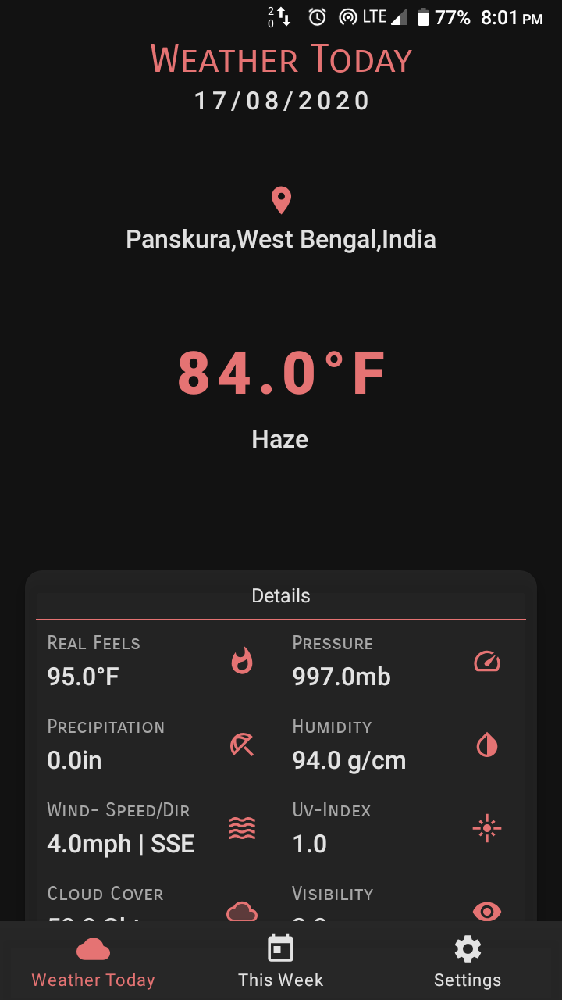
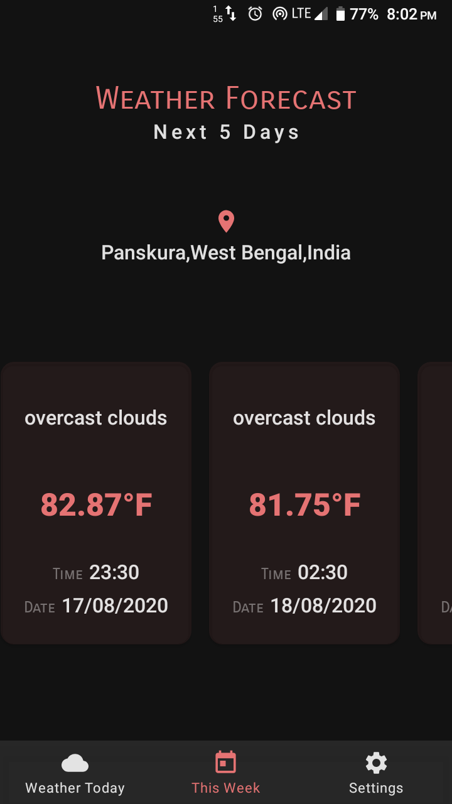
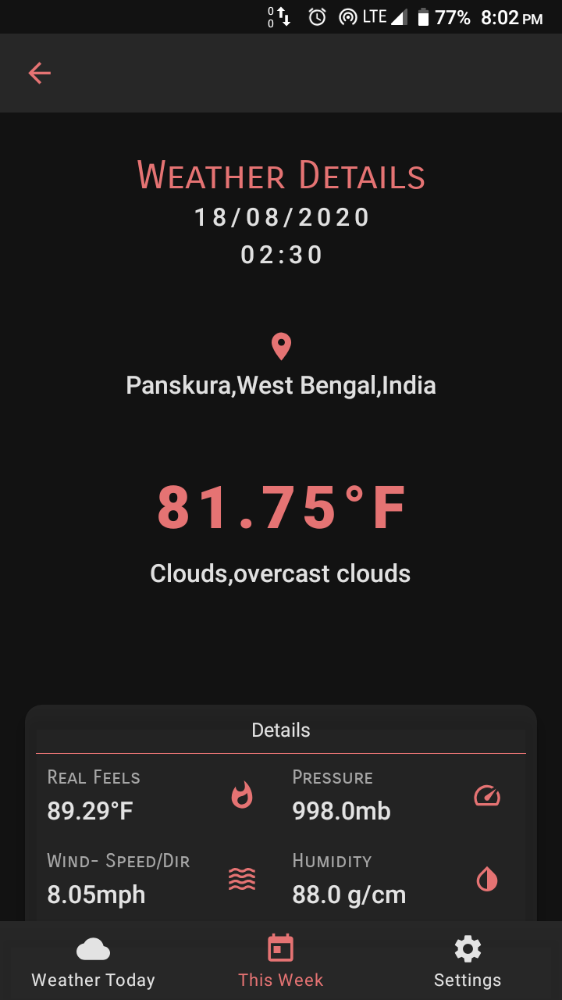
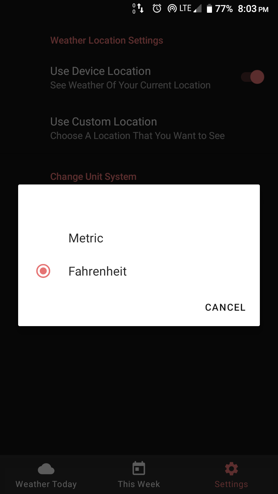
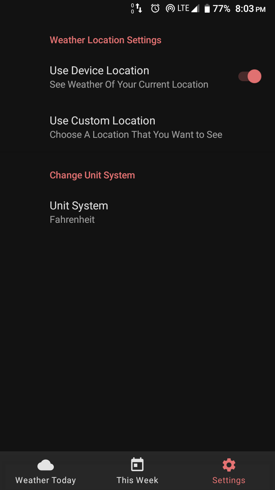

# Weather-Forecast-App

#### Playstore download link:https://play.google.com/store/apps/details?id=com.samriddha.weatherforecastapp

This app can show you current weather according to your device location.Future weather section can show you more details about weather of your place,this section
will show you weather forecast of next 5 days.You can select any location and it will show you result based on that location.You can also change units between metric and fahrenheit.Local database caching makes this app usable 
even without internet connection.

Languages Used: Kotlin,Xml.

Libraries/Features:

1.Designed in mvvm architecture,single activity architecture.

2.Local memory caching with room database.

3.Api calls with Retrofit2.

4.Dependency injection with kodein.

5.Kotlin coroutines for background threading.

6.LiveData,view models,coroutines etc.

7.Navigation components for navigating between fragments.

8.Handeled permissions using EasyPermission library.

9.Recycler View using groupie library.

Screensorts of the app:

